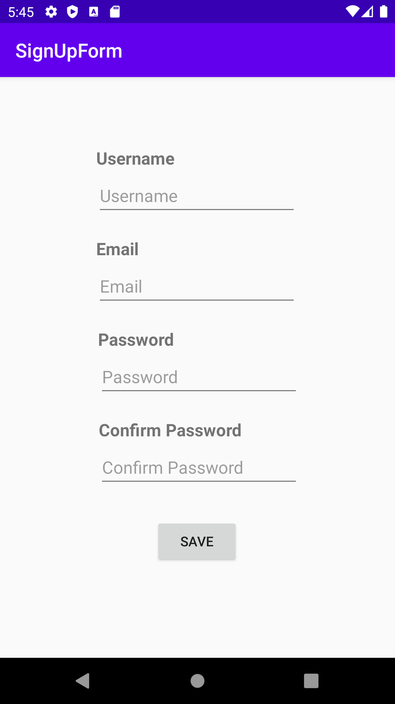
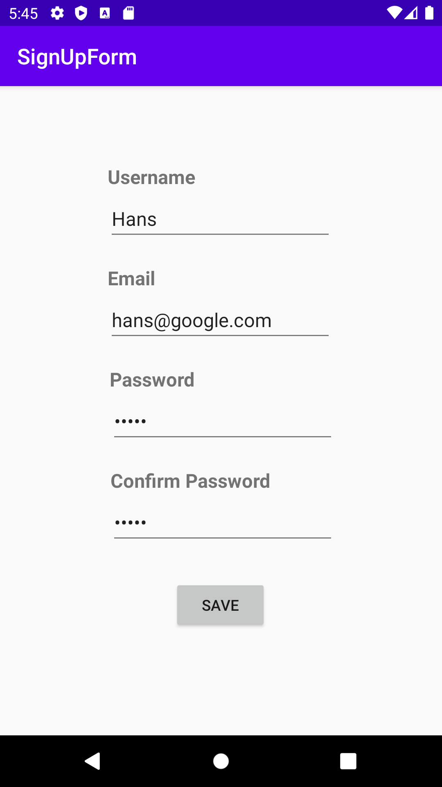
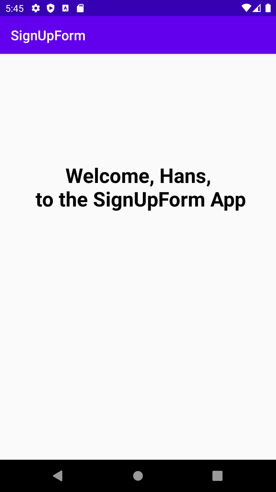

#SignUpForm Application

###Details
The application includes two layouts in total.
At the first layout, SignUp form with 4 input fields and 1 button will show up.
If all fields are complete and the passwords match, it will lead the user to the second layout.
At the second layout, it will greet the user with a message.

Below is the screenshots of the process
1.

2. 

3.
